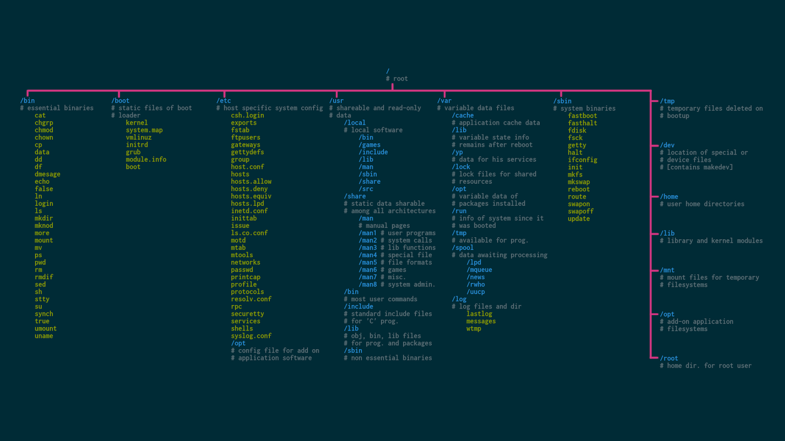
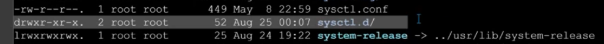
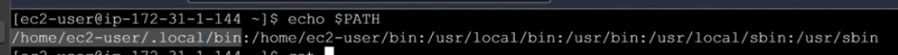
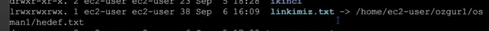
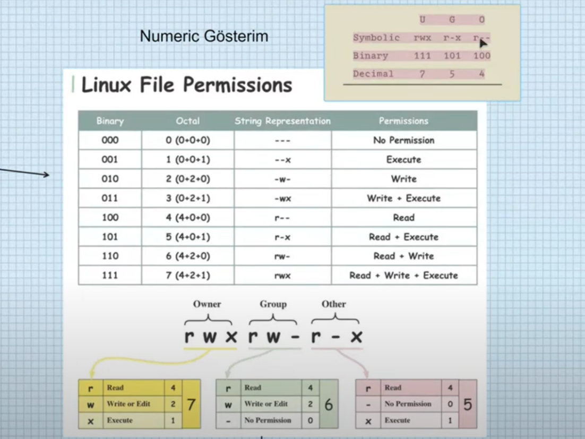
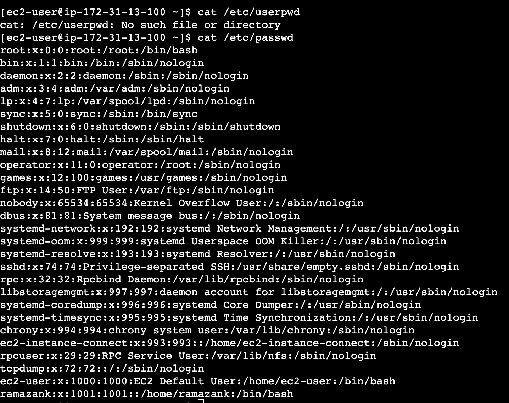
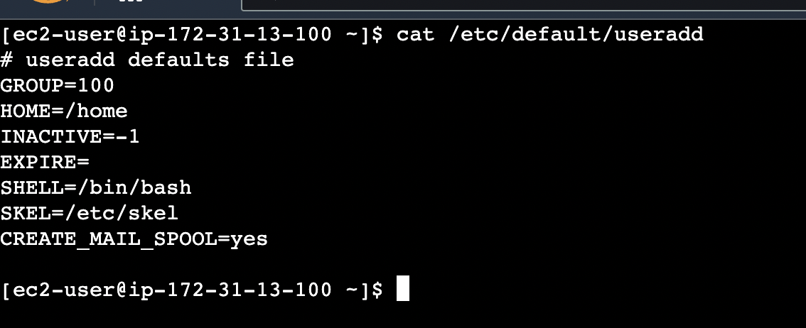
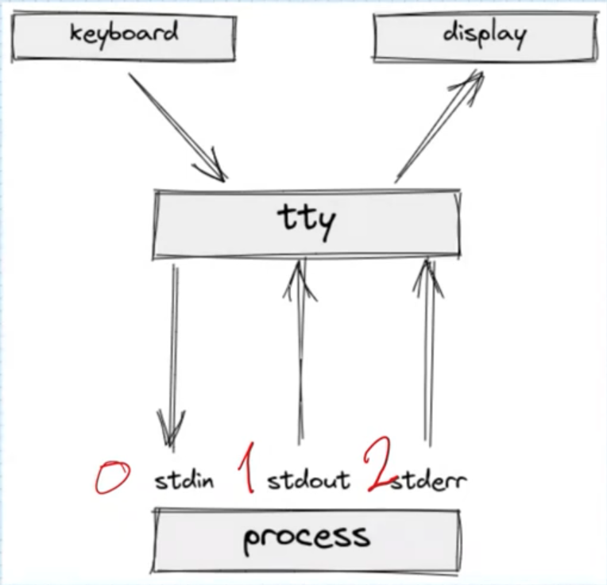

  
05.09.2023

  
## Linux'ın dizin yapısı

-------------------

## 32 bit işlemci ile 64 bit işlemci arasındaki fark

İşlemcinin her bir döngüde işleyebileceği stringin boyutunu ifade eder. 32 bit işlemcisi olan bir bilgiisayara sadece 32 bit e göre yazılmış işletim sistemi yüklenebilir. 

## x86 ve x64 nedir

x86 işlemci üreten intel firmasının ürettiği işlemci modelinden ismini almaktadır. 8086 ve 8088 işlemci mimarisi ailelerinden ismini almaktadır. Aslında bu kavram mimarini adıdır. 62 bit işlemciler için de aynı mimari kullanılmış ve ilk başlarda x86-64 olarak adlandırılan bu işlemciler bir süre sonra x64 olarak kullanılmıştır.

## terminal ile shell farkı nedir

Terminal shell ile konuşan bir ön uygulamadır. Input olarak komutları alır ve shell'e iletir. Shell gelen komutu işler ve terminal iletir. (interpretter komut işleyici bash) 

-----------------

* Her kullanıcın linux üzerinde home folder'ı vardır. Linux multiuser kullanıma uygun bir işletim sistemidir. ~ işareti home folder'ını ifade eder.

* Linux'ta hersey bir dosyadir. 

* ls -l komutu ile gelen outputun başında d var ise bu klasor olduğunu ifade eder. l var ise link olduğunu ifade eder. Hiçbir şey yoksa dosya anlamına gelir.

------------

* Linux'ta bir komut girdiğimiz zaman $PATH env variable'ına atanmış değerde çalıştırılacak uygulamayı arar. Aşağıdaki şekilde sıra ile tüm dizinlere bakar ve uygulamayı bulduğunda çalıştırır.

  
06.09.2023

  
  * Linux tarafında linkleme ile windows'taki shortcut'a benzer bir yapı oluşturabiliriz. İki tip linkleme yapabiliriz. İlki soft (sembolik) ikincisi hard linktir. Dosyanın soft link olduğunu önündeki l harfinden anlayabilir ya da soft link için neye linkli olduğunu ok ile görebiliriz. Hard linkte l harfi satır başında  olmaz. Linklerin başka bir temel amacına örnek olarak; bir uyglamanın ilk versiyonunda ayarların bir x dizininde tutulduğunu varsayalım. Bu uygulamayı kullanacak diğer uygulamalar ayalar dosyalarını x dizininden alacak şekilde configure edilmiş olur. Sonraki versiyonlarda ayarları fakrlı bir dizine taşıdığımızda uygulamalar hala ayarları x te arayacakları için bu dizin içine linkleme yapabiliriz. Hem dosya hem de klasör için linkleme yapabiliriz. 

  * link dosya silinir ise ana dosya silinmez. 

  * ana dosya silinirse link dosya silinir. (ls ile listeleniyor olur ama içine girmeye çalıştığında dosya yok hatası verir) 
  

### vim 

* https://vim.rtorr.com/lang/tr cheat sheet

* Vim ile dosya editleme yapabiliriz. i harfi ile insert moduna geçip değişiklik yapabilir. esc ile düzenleme modundan çıkabiliriz. kayıt edip çıkmak için ise wq! kullanırız.

* Set nu ile satıların numaralarını gösterir. Tersi set nonu'dur.

* Set nonu ile satır numaraları silinir.

  

--------------------

## Linux dosya ve klasör yetkileri

  

  * Yetkileri iki farklı şekilde gösterebiliriz. rwx yada bu kombinasyonların octal karşılıkları şeklinde ifade edebiliriz. Aşağıdaki görsele göre alabileceği değerleri inceleyebiliriz.

  

  * Genelde kullanılan yetkiler;
  700 -> - rwx --- ---
  755 -> - rwx r-x r-x
  664 -> - rw- rw- r--
  660 -> - rw- rw- ---
  644 -> - rw- r-- r--

* 777 ve 666 yetkileri verilirken dikkat edilmelidir. Çünkü sistemde herkesin dosyayı çalıştırabilmesine ya da güncelleme yapabilmesine olanak sağlamış oluruz. Hack durumunda ya da hatalı işlem yapılması durumunda sonuçlar kötü olabilir.

* Linux'ta bir klasor yaratıldığında varsayılan yetkisi 777, dosya yaratıldığında 666'dır. Fakat umask sistemi ile varsayılan olarak atanacak yetkileri değiştirebiliriz. Kullanıcı bazlı bu umask düzenlenir. 

* Sistem üzerindeki kullanıcılar /etc/passwd dosyası altında bulunmaktadır.

  

* /etc/default/useradd dosyasında user yaratılırken kullanılacak defaultlar belirlenir. 

  

* Sistem ile ilgili işlemler yaparken ya root kullanıcıya geçmeliyiz ya da sudo komutu ile root kullanıcı gibi işlem yapmalıyız. Sudo sudoer olarak atanmış kullanıcıların çalıştırabileceği bir komuttur.

* su ile shell içinde kullanıcı değiştirme işlemi yaparsak yeni bir session başlar. Bu sesion üzerinde ex,t komutu çalıştırırsak önceki user session'ına döner. Tekrar exit yaptığımızda logout işlemi yapar.

* Linux dünyasında her kullanıcı kendi adında bir gruba eklenir. 

* Her linux distrosunda özel bir sudoer grubu vardır. Bu gruba eklenen kullanıcılar sudo yapabilirler. debian temelli distrolarda sudo grubu, fedora temelli distrolarda wheel gruplarına eklenen user'lar sudo komutuna yetkileri olur. 

  
07.09.2023

  
  * Linux multiuser kullanıma uygun bir sistem olduğu ve userların yetki yönetimlerini daha rahat yapabilmek için group'lar kullanılabilir. 

  * Groupları /etc/groups dosyasında görebiliriz.

  * Dosyaların grouplarla da bir ilişkisi vardır. Varsayılan olarak dosyayı yaratan userın ana group'u dosyanın da group'u olur. Bu group'taki userlar yetkisi doğrultusunda dosya üzerinde işlem yapabilir. 

----------------

### stdin - stdout - stderror

* Linux üzerinde bir uygulama çalıştığında (process) bu process'e 3 tane stream yapıştırılır. Bunlar stdin, stdout ve stderror'dur.

  

* stdin giriştir ve klavyeye bağlıdır diyebiliriz. Process'e input göndermek istediğimizde bu stream kullanılır. 

* stdout çıkış stream'dir. Process çalıştıktan sonra stdout stream'ine output var ise gönderir.

* stderror da process çalışırken bir hata alırsa kullanılan streamdir. 

#### Operatörler

##### > 

> operatörü ile stdout stream'ine gelen veriyi dosyaya redirect edebiliriz. Ezici bir operatördür. Yani yönlendirme yapılan doyada satır varsa ezilecektir. 

##### <

> operatörü ile komuta bir değeri redirect etmek istersek kullanabiliriz. Bir text dosyasının içeriğini mail olarak gönderecek bir uygulamamız olduğunu varsayalım. Bu durumda "mail x@x.com < mail.txt" komutu ile bu işlemi yapabiliriz. 

##### >>

> operatörü ile append işlemi yapılabilir.

##### | 

> pipe ile komutların stdout'larını sonraki process'in stdin'ine gönderebiliriz. Zincir şekilde komut çalıştırabilmek için kullanabiliriz.

#### ;

> Komutları sırası ile çalıştırır.  Önceki komutun hata alması sonraki komutların çalışmasını engellemez. 

##### &&

> Komutları sıra ile çalıştırmayı dener, hata aldığında sonraki komutları çalıştırmaz. 

##### ||

> Komutları sıra ile çalıştırmayı dener, hata aldığında sonraki komutu çalıştırır.
 
-----------
 
* allias'lar ile uzun komutları kısa bir komuta atayarak sürekli kullanımda kolaylık sağlayabiliriz.

* home directory'deki .bash_profile dosyasinda yazan komutlar login olarak terminali kullanan kullacılar için çalıştırılır. 

* .bashrc dosyasında ki komutlar ise non-login olarak çalıştırılan oturumlarda çalıştırılır. non-login, login olunarak açılmış bir oturumda bash ile yeni bir oturum açarak sağlanabilir. 

* Fakat bash_profile dosyasında da bashrc dosyası yüklendiği için her koşulda bashrc dosyası çalıştılıyor diye düşünebiliriz.

* bash_logout dosyası içine logout olurken execute edilmesini istediğimiz kodları yazabiliriz

